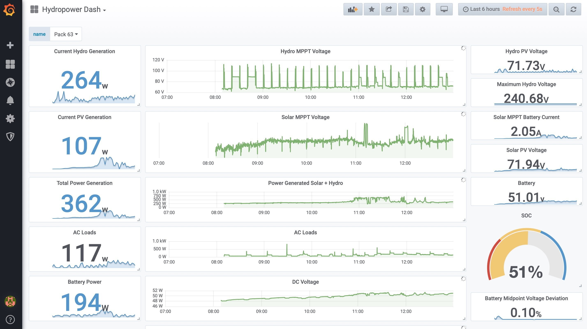
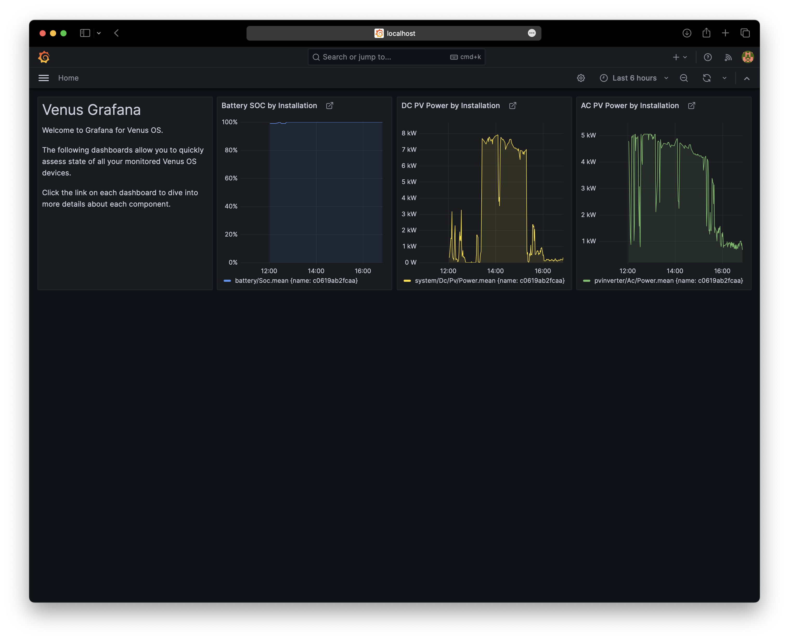
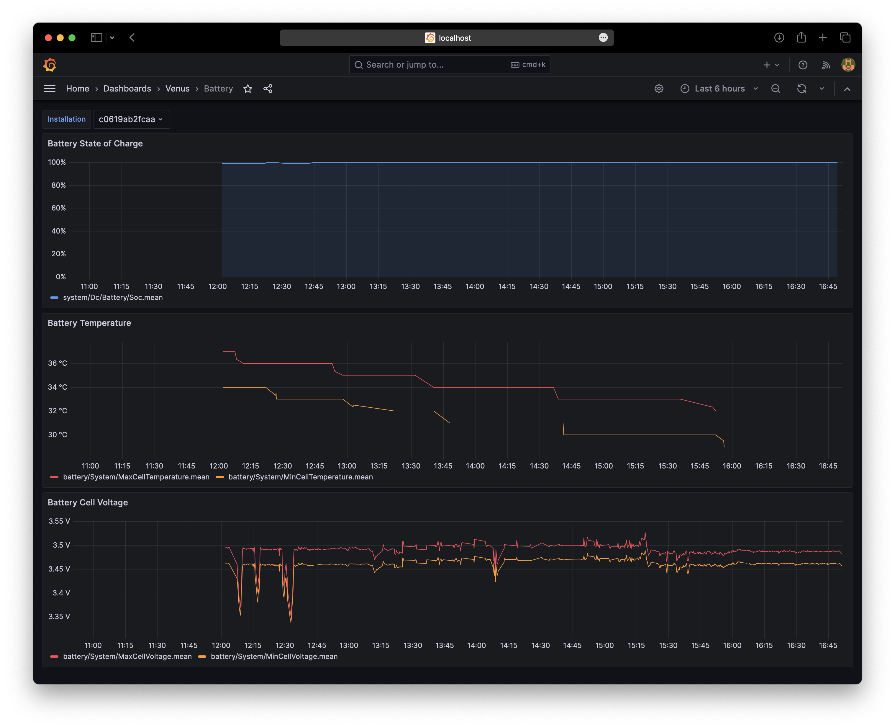
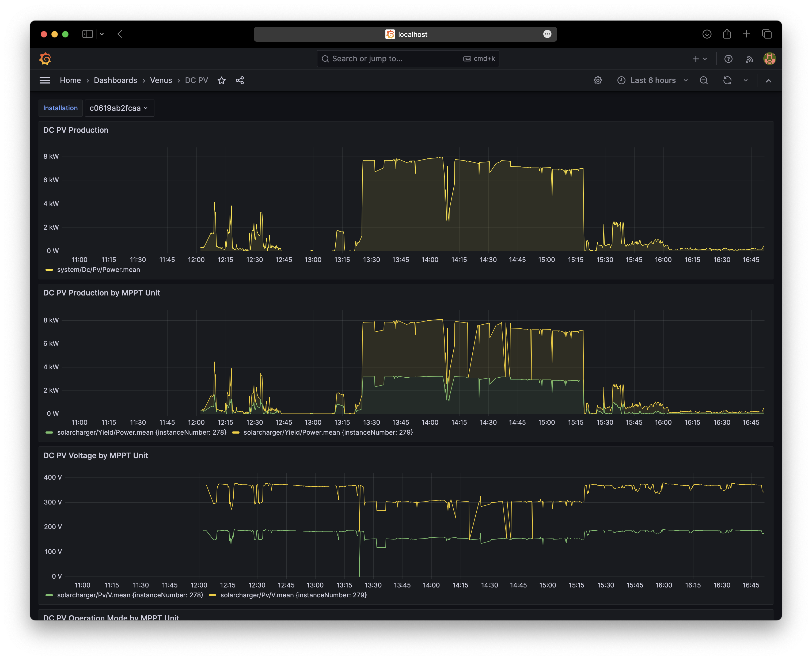

# Venus Grafana: Advanced Victron Dashboarding

## 1. Introduction

Venus Grafana is a dashboarding solution for Victron Energy systems.
Its a niche alternative to the main Victron monitoring and dashboarding solution, the [VRM Portal](https://vrm.victronenergy.com).

Compared to VRM, the Venus Grafana is:

- More work to install & configure.
- Not officially supported by Victron.

Once configured, Venus Grafana offers:

- Offline monitoring: It can run on a computer close to a Victron system and does not require internet connection. Works great on boats, or RVs.
- More granular data: all measurements are recorded at approx. two second interval.
- More graphing and visualization options and customization.

Venus Grafana can work with one or more GX Devices on your local network, as well as connect
to other GX devices via the VRM cloud.

Note that [Grafana](https://www.grafana.com) is not a Victron product. It is a widely popular dashboarding solution supporting many data sources, visualization options, and plugins, and is under constant development.

Example Grafana Dashboard:




Getting Started with Victron & Grafana - [Part 1](https://www.youtube.com/watch?v=IkNuadRbANA), and [Part 2](http://www.youtube.com/watch?v=B-sGH0etieM) are very useful resources to get a general overview of how Venus Grafana started, where it is going, and what it has to offer:

[](https://www.youtube.com/watch?v=IkNuadRbANA "Getting Started with Victron & Grafana Dashboard - Part 1")

[](http://www.youtube.com/watch?v=B-sGH0etieM "Getting Started with Victron & Grafana Dashboard - Part 2")

## 2. Requirements

1. A Victron Energy system including a [Victron GX Device](https://www.victronenergy.com/live/venus-os:start).
2. A computer capable of running [InfluxDB](https://www.influxdata.com).
3. A computer capable of runing [Grafana](https://grafana.com/grafana/).
4. A computer capable of running [Venus Influx Loader](https://github.com/victronenergy/venus-influx-loader).

All of these can run separately, or together. Natively on a Mac, Windows, Raspberry PI, or any box that supports [Docker](https://www.docker.com) containers. It can be also any cloud hosting provider, for example [AWS](AWS.md).

> **Note:** Patience and willingness is required to study and figure all this out. Beware that Venus Grafana is not an officially supported Victron solution. Neither Victron, nor its partners, and dealers will help you in case of problems. For support, reach to
[Victron Community Grafana Discussion Forum](https://communityarchive.victronenergy.com/search.html?c=&includeChildren=&f=&type=question+OR+idea+OR+kbentry+OR+answer+OR+topic+OR+user&redirect=search%2Fsearch&sort=relevance&q=grafana).

## 3. Quick Start

1. Enable plaintext MQTT service on your Venus OS device by accessing the remote console and going to Settings -> Services.
1. Download [Docker Desktop](https://www.docker.com/products/docker-desktop/) for your platform.
1. Download the ready made [examples/docker-compose.yaml](./examples/docker-compose.yaml) file and use the `docker compose up` to start all containers (see below for more details).
1. Open http://localhost:8088 in your browser and configure what Venus devices to monitor. Default username and password is `admin` `admin`.
1. Open http://localhost:3000 in your browser to play with Grafana. Default username and password is `admin` `admin`.


### 3.1 Starting / Stopping

This command downloads necessary docker images, creates docker volumes to store data, creates docker containers for Influx DB, Grafana, and Venus Influx Loader and starts them.


```
$ docker compose up
```

This command stops all docker containers and leaves the docker volumes in place so you do not loose any data.

```
$ docker compose stop
```

WARNING: This command stops all docker containers, but them removes the containers and the volumes with all collected data and all your customizations.

```
$ docker compose down
```

### 3.2 Updating / Restarting

If you specify a floating docker image tag like `:latest`, `:develop`, or `:main` in your `docker-compose.yaml` file, the following commands allow you to update and restart your setup.

This command fetches latest versions of required docker images.

```
$ docker compose pull
```

This command re-creates and re-starts containers for which new versions of docker images are available.

```
$ docker compose up
```

### 3.3 Automatic Restart

Note that the [examples/docker-compose.yaml](./examples/docker-compose.yaml) file does not specify a `restart` policy for any of the containers. This means that when any of the containers crashes, or when your host system is restarted, no containers will get restarted automatically. This is useful for basic experimentation.

If you plan to deploy your Venus Grafana into production, it is recommended to configure a `restart: always` [container restart policy](https://docs.docker.com/config/containers/start-containers-automatically/) for all of the containers.

## 4. Venus Grafana Deployment Details

Examining [examples/docker-compose.yaml](./examples/docker-compose.yaml) we can find that it defines the following components:

### 4.1 Storage

Creates [Docker Volumes](https://docs.docker.com/storage/volumes/) (directories that survive docker container rebuild/restart) to store configuration for Venus Influx Loader, Venus Grafana, and Influx DB.

```
volumes:
  influxdb-storage:
  grafana-storage:
  config-storage:
```

### 4.2 InfluxDB

Creates Influx DB container exposing TCP port 8086 and storing database data in the docker volume `influxdb-storage`. This is where all the recorded measurements will be persisted. Note: InfluxDB is pinned at version 1.8. This is the latest (now unsupported) version that supports 32bit arm architectures (32bit Raspberry Pi).

```
services:
  influxdb:
    image: "influxdb:1.8"
    ports:
     - "8086:8086"
    volumes:
     - "influxdb-storage:/var/lib/influxdb"
    environment:
     - INFLUXDB_HTTP_LOG_ENABLED=false
```

### 4.3 Venus Influx Loader

Creates Venus Influx Loader container exposing TCP port 8088 and storing its configuration in `config-storage`.

```
services:
  loader:
    image: "victronenergy/venus-influx-loader:main"
    ports:
     - "8088:8088"
    volumes:
     - "config-storage:/config"
```

### 4.4 Venus Grafana

Creates Venus Grafana container exposing TCP port 3000 and storing its configuration in `grafana-storage`.

```
services:
  grafana:
    image: "victronenergy/venus-grafana:main"
    volumes:
     - "grafana-storage:/var/lib/grafana"
    ports:
     - "3000:3000"
    environment:
     - VIL_INFLUXDB_URL=http://influxdb:8086
     - VIL_GRAFANA_API_URL=http://loader:8088/grafana-api
```

Note the environment variables `VIL_INFLUXDB_URL` and `VIL_GRAFANA_API_URL` that tell Grafana how to connect to our Influx DB and Venus Influx Loader. The hostnames `influxdb` and `loader` actually refer to the container names.

### 4.3 Random Tips & Notes

Docker containers are started in random order, especially when the system is rebooted. All components may log warnings or errors, for example when `loader` fails to connect to (not yet running) `influxdb`.

Docker volumes are easy to create but notoriously complicated to work with. They exist as opaque structure on your host system and you can not see inside.

It may be easier to use [bind mounts](https://docs.docker.com/storage/bind-mounts/) to make host system directories available to docker containers. That way you can expose USB stick to the containers and still read it from your host sytem. But bind mounts have problems with permissions that need to be setup correctly.

## 5. Included Dashboards

The following dashboards are included by default.

### 5.1 Systems Overview

Welcome dashboard sumarizing battery state of charge, and DC/AC PV production. All charts are broken down by installation in case you are visualizing multiple Venus OS installations at the same time.



### 5.2 Battery

Battery dashboard sumarizes state of charge, min/max cell voltage, and min max cell temperature for selected Venus OS installation.



### 5.3 DC PV

DC PV dashboard sumarizes MPPT solarcharger output power, voltate, and operation mode for selected Venus OS installation. Charts are broken down by instance in case your system contains multiple MPPT Solar Chargers.



### 5.4 AC PV

AC PV dashboard sumarizes AC coupled output power, and power limit for selected Venus OS installation. Charts are broken down by instance in case your system contains multiple AC coupled inverters.


## 6. Creating Your Own Dashboards

Once you get familiar with Grafana, you will want to start exploring the measurements reported by Venus OS and to create your own visualizations. There is a great guide outlining [How to create new Venus Grafana Panel](./doc/GRAFANA-NEW-PANEL.md).


## 7. Distribution

Venus Grafana is distributed as:

- Docker Image: https://hub.docker.com/r/victronenergy/venus-grafana
- TODO: Venus Grafana Dashboards at https://grafana.com/grafana/dashboards/

## 8. Development

This repository contains source code to build Venus Grafana Docker Image that includes preconfigured data sources and dashboards.

### 8.1 Docker Image Configuration

The `venus-grafana` docker image can be configured using the following environment variables:

- `VIL_INFLUXDB_URL`: InfluxDB URL used by Grafana InfluxDB datasource.
  Example: `VIL_INFLUXDB_URL=http://localhost:8086`

- `VIL_INFLUXDB_USERNAME`: InfluxDB username used by Grafana InfluxDB datasource.
  Example: `VIL_INFLUXDB_USERNAME=s3cr4t`

- `VIL_INFLUXDB_PASSWORD`: InfluxDB password used by Grafana InfluxDB datasource.
  Example: `VIL_INFLUXDB_PASSWORD=s3cr4t`

- `VIL_GRAFANA_API_URL`: URL to access Grafana API endpoint of Venus Influx Loader.
  Example: `VIL_GRAFANA_API_URL=http://localhost:8088/grafana-api`


### 8.2 Docker Image Structure

The files located under `grafana/provisioning` contain a `yaml` and `json` configuration files that can be used to provision fresh Grafana installation using the [Grafana Provisioning](https://grafana.com/docs/grafana/latest/administration/provisioning/).

The `grafana/provisioning` directory needs to be copied over to `/etc/grafana/provisioning` directory on the system before starting up Grafana.

### 8.3 Building Venus Grafana Docker Image

Venus Grafana docker image provides an easy way to spin up a preconfigured and ready to be used grafana instance suitable for local development.

#### Build Venus Grafana docker image locally

```
$ export OWNER="martin"
$ (cd docker && ./build-dev-image.sh)
```

#### Run Venus Grafana docker image locally

```
$ export OWNER="martin"
$ (cd docker && ./run-dev-image.sh)
```

After that you can access the local Grafana instance via http://localhost:3000

### 8.4 Adding New Dashboards

New Grafana Dashboards that you create via Grafana Interface will be stored in a SQLite database inside the docker container in `/var/lib/grafana`. These modifications will get lost when the container is removed and recreated, unless you mount the `/var/lib/grafana` directory to a docker volume.

It is strongly recommended to export the dashboards in JSON format once you are happy with them, and commit the exported JSON file into `grafana/provisioning/dashboards` structure so that it is picked up automatically on next container build.

The process of creating new dashboards looks like this:

1. Start Grafana, go to the admin UI via http://localhost:3000.
2. Create new dashboard and panels, configure them as needed.
3. Export the dashboard in JSON file and save it to this repository under `grafana/provisioning`.
4. Open the saved panel and change `uid` near the end of the file to the same name you gave to the JSON file without extension so that you can later link to that new panel.
5. Linking to the panel is possible via relative link `/d/<uid>/<uid>` where `<uid>`. For example `/d/battery/battery` will link to the dashboard provisioned from `battery.json`.
6. Stop Grafana, Rebuild dev image, and repeat from step 1.


### 8.5 Changing the Home Dashboard

Grafana will by default display a home dashboard specified via `GF_DASHBOARDS_DEFAULT_HOME_DASHBOARD_PATH`. For the `venus-grafana` docker image this variable is configured in `docker/entrypoint.sh` file.

