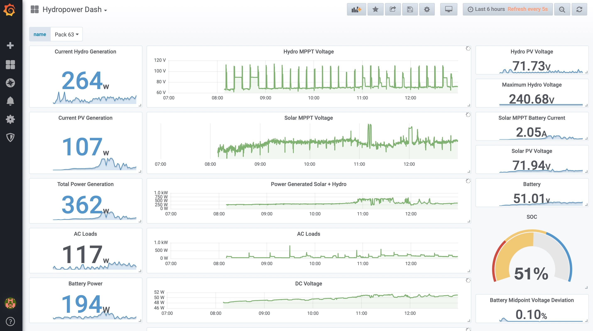
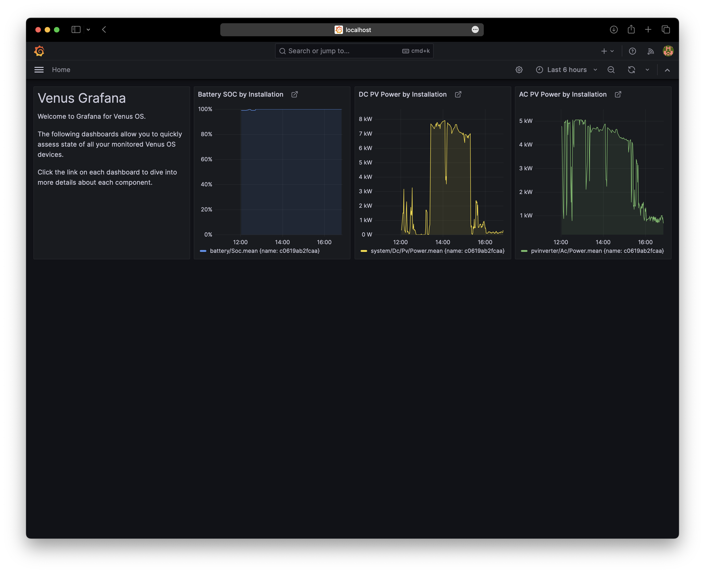
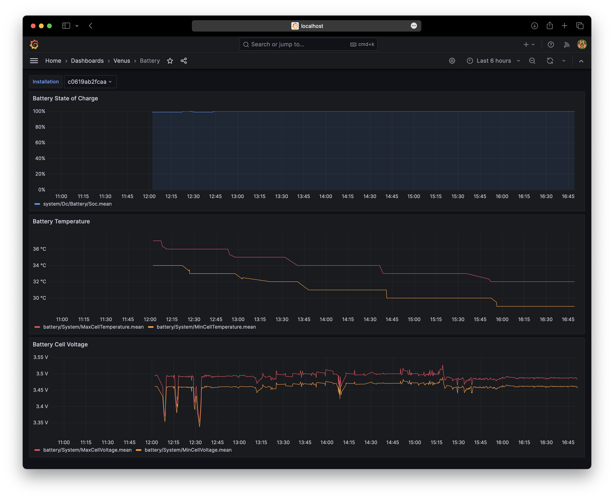
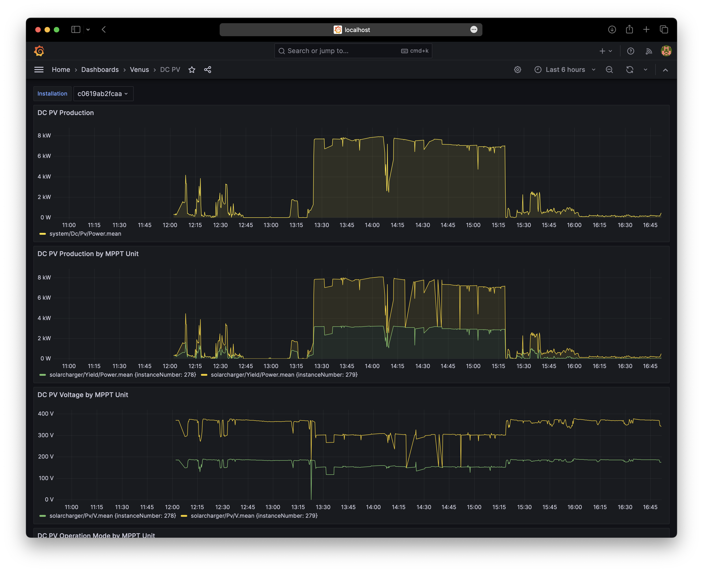
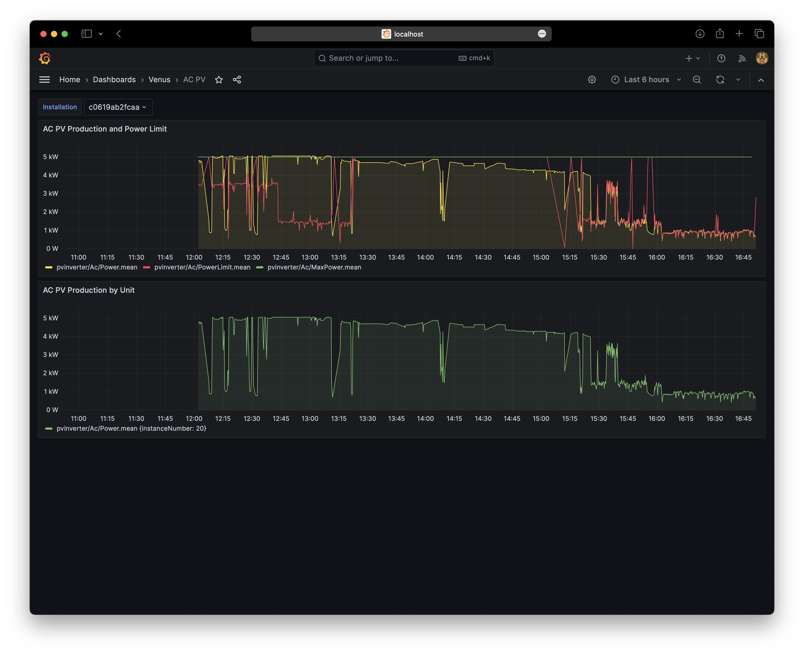

# Venus Grafana: Advanced Victron Dashboarding

## 1. Introduction

Venus Grafana is a dashboarding solution for Victron Energy systems.
Its a niche alternative to the main Victron monitoring and dashboarding solution, the [VRM Portal](https://vrm.victronenergy.com).

Compared to VRM, the Venus Grafana is:

- More work to install & configure.
- Not officially supported by Victron.

Once configured, Venus Grafana offers:

- Offline monitoring: It can run on a computer close to a Victron system and does not require internet connection. Works great on boats, or RVs.
- More granular data: all measurements are recorded at approx. two second interval.
- More graphing and visualization options and customization.

Venus Grafana can work with one or more GX Devices on your local network, as well as connect
to other GX devices via the VRM cloud.

Note that [Grafana](https://www.grafana.com) is not a Victron product. It is a widely popular dashboarding solution supporting many data sources, visualization options, and plugins, and is under constant development.

Example Grafana Dashboard:




Getting Started with Victron & Grafana - [Part 1](https://www.youtube.com/watch?v=IkNuadRbANA), and [Part 2](http://www.youtube.com/watch?v=B-sGH0etieM) are very useful resources to get a general overview of how Venus Grafana started, where it is going, and what it has to offer:

[](https://www.youtube.com/watch?v=IkNuadRbANA "Getting Started with Victron & Grafana Dashboard - Part 1")

[](http://www.youtube.com/watch?v=B-sGH0etieM "Getting Started with Victron & Grafana Dashboard - Part 2")

## 2. Requirements

1. A Victron Energy system including a [Victron GX Device](https://www.victronenergy.com/live/venus-os:start).
2. A computer capable of running [InfluxDB](https://www.influxdata.com).
3. A computer capable of runing [Grafana](https://grafana.com/grafana/).
4. A computer capable of running [Venus Influx Loader](https://github.com/victronenergy/venus-influx-loader).

All of these can run separately, or together. Natively on a Mac, Windows, Raspberry PI, or any box that supports [Docker](https://www.docker.com) containers. It can be also any cloud hosting provider, for example [AWS](AWS.md).

> **Note:** Patience and willingness is required to study and figure all this out. Beware that Venus Grafana is not an officially supported Victron solution. Neither Victron, nor its partners, and dealers will help you in case of problems. 

> For support, reach out to [Victron Community Grafana Discussion Topics](https://community.victronenergy.com/tag/grafana). Or check out the archive of our old community here :
[Victron Community Archive - Grafana Discussion Forum](https://communityarchive.victronenergy.com/search.html?c=&includeChildren=&f=&type=question+OR+idea+OR+kbentry+OR+answer+OR+topic+OR+user&redirect=search%2Fsearch&sort=relevance&q=grafana) which is still a valuable source of information.

## 3. Quick Start

1. Enable plaintext MQTT service on your Venus OS device by accessing the remote console and going to Settings -> Services.
1. Download [Docker Desktop](https://www.docker.com/products/docker-desktop/) for your platform.
1. Download the ready made [examples/docker-compose.yaml](./examples/docker-compose.yaml) file and use the `docker compose up` to start all containers (see below for more details).
1. Open http://localhost:8088 in your browser and configure what Venus devices to monitor. Default username and password is `admin` `admin`.
1. Open http://localhost:3000 in your browser to play with Grafana. Default username and password is `admin` `admin`.


### 3.1 Starting / Stopping

This command downloads necessary docker images, creates docker volumes to store data, creates docker containers for Influx DB, Grafana, and Venus Influx Loader and starts them.


```
$ docker compose up
```

This command stops all docker containers and leaves the docker volumes in place so you do not loose any data.

```
$ docker compose stop
```

WARNING: This command stops all docker containers, but them removes the containers and the volumes with all collected data and all your customizations.

```
$ docker compose down
```

### 3.2 Updating / Restarting

If you specify a floating docker image tag like `:latest`, `:develop`, or `:main` in your `docker-compose.yaml` file, the following commands allow you to update and restart your setup.

This command fetches latest versions of required docker images.

```
$ docker compose pull
```

This command re-creates and re-starts containers for which new versions of docker images are available.

```
$ docker compose up
```

### 3.3 Automatic Restart

Note that the [examples/docker-compose.yaml](./examples/docker-compose.yaml) file does not specify a `restart` policy for any of the containers. This means that when any of the containers crashes, or when your host system is restarted, no containers will get restarted automatically. This is useful for basic experimentation.

If you plan to deploy your Venus Grafana into production, it is recommended to configure a `restart: always` [container restart policy](https://docs.docker.com/config/containers/start-containers-automatically/) for all of the containers.

## 4. Venus Grafana Deployment Details

Examining [examples/docker-compose.yaml](./examples/docker-compose.yaml) we can find that it defines the following components:

### 4.1 Storage

Creates [Docker Volumes](https://docs.docker.com/storage/volumes/) (directories that survive docker container rebuild/restart) to store configuration for Venus Influx Loader, Venus Grafana, and Influx DB.

```
volumes:
  influxdb-storage:
  grafana-storage:
  config-storage:
```

### 4.2 InfluxDB

Creates Influx DB container exposing TCP port 8086 and storing database data in the docker volume `influxdb-storage`. This is where all the recorded measurements will be persisted. Note: InfluxDB is pinned at version 1.8. This is the latest (now unsupported) version that supports 32bit arm architectures (32bit Raspberry Pi).

```
services:
  influxdb:
    image: "influxdb:1.8"
    ports:
     - "8086:8086"
    volumes:
     - "influxdb-storage:/var/lib/influxdb"
    environment:
     - INFLUXDB_HTTP_LOG_ENABLED=false
```

### 4.3 Venus Influx Loader

Creates Venus Influx Loader container exposing TCP port 8088 and storing its configuration in `config-storage`.

```
services:
  loader:
    image: "victronenergy/venus-influx-loader:main"
    ports:
     - "8088:8088"
    volumes:
     - "config-storage:/config"
```

### 4.4 Venus Grafana

Creates Venus Grafana container exposing TCP port 3000 and storing its configuration in `grafana-storage`.

```
services:
  grafana:
    image: "victronenergy/venus-grafana:main"
    volumes:
     - "grafana-storage:/var/lib/grafana"
    ports:
     - "3000:3000"
    environment:
     - VIL_INFLUXDB_URL=http://influxdb:8086
     - VIL_GRAFANA_API_URL=http://loader:8088/grafana-api
     - VIL_PUBLIC_URL=http://localhost:8088/
```

Note the environment variables `VIL_INFLUXDB_URL` and `VIL_GRAFANA_API_URL` that tell Grafana how to connect to our Influx DB and Venus Influx Loader. The hostnames `influxdb` and `loader` actually refer to the container names.

The environment variable `VIL_PUBLIC_URL` specifies what URL to use to access Venus Influx Loader. This URL will be displayed on the Venus Grafana Welcome page to guide users to Venus Influx Loader Settings.

### 4.3 Random Tips & Notes

Docker containers are started in random order, especially when the system is rebooted. All components may log warnings or errors, for example when `loader` fails to connect to (not yet running) `influxdb`.

Docker volumes are easy to create but notoriously complicated to work with. They exist as opaque structure on your host system and you can not see inside.

It may be easier to use [bind mounts](https://docs.docker.com/storage/bind-mounts/) to make host system directories available to docker containers. That way you can expose USB stick to the containers and still read it from your host sytem. But bind mounts have problems with permissions that need to be setup correctly.

## 5. Included Dashboards

The following dashboards are included by default.

### 5.1 Systems Overview

Welcome dashboard sumarizing battery state of charge, and DC/AC PV production. All charts are broken down by installation in case you are visualizing multiple Venus OS installations at the same time.



### 5.2 Battery

Battery dashboard sumarizes state of charge, min/max cell voltage, and min max cell temperature for selected Venus OS installation.



### 5.3 DC PV

DC PV dashboard sumarizes MPPT solarcharger output power, voltate, and operation mode for selected Venus OS installation. Charts are broken down by instance in case your system contains multiple MPPT Solar Chargers.



### 5.4 AC PV

AC PV dashboard sumarizes AC coupled output power, and power limit for selected Venus OS installation. Charts are broken down by instance in case your system contains multiple AC coupled inverters.



## 6. Creating Your Own Dashboards

Once you get familiar with Grafana, you will want to start exploring the measurements reported by Venus OS and to create your own visualizations. There is a great guide outlining [How to create new Venus Grafana Panel](./doc/GRAFANA-NEW-PANEL.md).


## 7. Distribution

Venus Grafana is distributed as:

- Docker Image: https://hub.docker.com/r/victronenergy/venus-grafana
- TODO: Venus Grafana Dashboards at https://grafana.com/grafana/dashboards/

## 8. Development

This repository contains source code to build Venus Grafana Docker Image that includes preconfigured data sources and dashboards.

### 8.1 Docker Image Configuration

The `venus-grafana` docker image can be configured using the following environment variables:

- `VIL_INFLUXDB_URL`: InfluxDB URL used by Grafana InfluxDB datasource.
  Example: `VIL_INFLUXDB_URL=http://localhost:8086`

- `VIL_INFLUXDB_USERNAME`: InfluxDB username used by Grafana InfluxDB datasource.
  Example: `VIL_INFLUXDB_USERNAME=s3cr4t`

- `VIL_INFLUXDB_PASSWORD`: InfluxDB password used by Grafana InfluxDB datasource.
  Example: `VIL_INFLUXDB_PASSWORD=s3cr4t`

- `VIL_GRAFANA_API_URL`: URL to access Grafana API endpoint of Venus Influx Loader.
  Example: `VIL_GRAFANA_API_URL=http://localhost:8088/grafana-api`

- `VIL_PUBLIC_URL`: Public URL of Venus Influx Loader, linked from the welcome dashboard.
  Example: `VIL_PUBLIC_URL=http://localhost:8088`

- `VIL_HOME_DASHBOARD_TITLE`: Exact title of the dashboard shown as the Grafana home page. Works for the dashboards shipped in the image as well as for dashboards synced from GitHub. See 8.5. Default: `Welcome`.
  Example: `VIL_HOME_DASHBOARD_TITLE=Diagnostics`

- `VIL_HOME_DASHBOARD_UID`: Alternative to `VIL_HOME_DASHBOARD_TITLE` that selects the home dashboard by its UID, for when several dashboards share a title. See 8.5.
  Example: `VIL_HOME_DASHBOARD_UID=battery`

Optional variables to sync dashboards from your own GitHub repository via Grafana Git Sync (see 8.6):

- `VIL_GITSYNC_GITHUB_URL`: GitHub repository URL. Setting this enables Git Sync.
  Example: `VIL_GITSYNC_GITHUB_URL=https://github.com/me/my-dashboards`

- `VIL_GITSYNC_GITHUB_TOKEN`: GitHub Personal Access Token. Alternatively `VIL_GITSYNC_GITHUB_TOKEN__FILE` points to a file containing the token (docker secrets).

- `VIL_GITSYNC_GITHUB_BRANCH`: Branch to sync. Default: `main`.

- `VIL_GITSYNC_GITHUB_PATH`: Sub-path inside the repository that holds the dashboard JSON files. Default: repository root.
  Example: `VIL_GITSYNC_GITHUB_PATH=grafana/`

- `VIL_GITSYNC_TITLE`: Name shown in Grafana and used for the folder holding the synced dashboards. Default: `GitHub`.

- `VIL_GITSYNC_WORKFLOWS`: Comma separated list of `write` (save from Grafana straight to the branch) and `branch` (save to a new branch and open a pull request). Set empty for pull-only. Default: `write,branch`.

- `VIL_GITSYNC_TARGET`: `folder` or `folderless`. Default: `folder`.

- `VIL_GITSYNC_INTERVAL_SECONDS`: How often Grafana polls GitHub for changes. Default: `60`.


### 8.2 Docker Image Structure

The files located under `grafana/provisioning` contain a `yaml` and `json` configuration files that can be used to provision fresh Grafana installation using the [Grafana Provisioning](https://grafana.com/docs/grafana/latest/administration/provisioning/).

The `grafana/provisioning` directory needs to be copied over to `/etc/grafana/provisioning` directory on the system before starting up Grafana.

### 8.3 Building Venus Grafana Docker Image

Venus Grafana docker image provides an easy way to spin up a preconfigured and ready to be used grafana instance suitable for local development.

#### Build Venus Grafana docker image locally

```
$ export OWNER="martin"
$ (cd docker && ./build-dev-image.sh)
```

#### Run Venus Grafana docker image locally

```
$ export OWNER="martin"
$ (cd docker && ./run-dev-image.sh)
```

After that you can access the local Grafana instance via http://localhost:3000

### 8.4 Adding New Dashboards

New Grafana Dashboards that you create via Grafana Interface will be stored in a SQLite database inside the docker container in `/var/lib/grafana`. These modifications will get lost when the container is removed and recreated, unless you mount the `/var/lib/grafana` directory to a docker volume.

It is strongly recommended to export the dashboards in JSON format once you are happy with them, and commit the exported JSON file into `grafana/provisioning/dashboards` structure so that it is picked up automatically on next container build.

The process of creating new dashboards looks like this:

1. Start Grafana, go to the admin UI via http://localhost:3000.
2. Create new dashboard and panels, configure them as needed.
3. Export the dashboard in JSON file and save it to this repository under `grafana/provisioning`.
4. Open the saved panel and change `uid` near the end of the file to the same name you gave to the JSON file without extension so that you can later link to that new panel.
5. Linking to the panel is possible via relative link `/d/<uid>/<uid>` where `<uid>`. For example `/d/battery/battery` will link to the dashboard provisioned from `battery.json`.
6. Stop Grafana, Rebuild dev image, and repeat from step 1.


### 8.5 Changing the Home Dashboard

By default Grafana shows the Venus Grafana welcome dashboard as its home page. The `venus-grafana` image sets `GF_DASHBOARDS_DEFAULT_HOME_DASHBOARD_PATH` to `welcome.json` in `docker/entrypoint.sh`, which is Grafana's file based fallback.

To show a different dashboard on the home page set `VIL_HOME_DASHBOARD_TITLE` to the exact title of that dashboard, as displayed in Grafana, for example in `docker-compose.yaml`:

```yaml
  grafana:
    image: "victronenergy/venus-grafana:1.8"
    environment:
     - VIL_HOME_DASHBOARD_TITLE=Battery
```

The title is matched case sensitively and may contain spaces and punctuation, no quoting is needed in `docker-compose.yaml` or `.env` files:

```
VIL_HOME_DASHBOARD_TITLE=Example 1: Instant vs Over Time Measurements
```

At startup `docker/home-dashboard-bootstrap.sh` waits until a dashboard with that title exists, looks up its UID through the Grafana search API and stores it as the organization default home dashboard through the Grafana preferences API (`PATCH /api/org/preferences`). This works for every dashboard Grafana knows about, including dashboards synced from GitHub via Git Sync (8.6), which Grafana keeps in its database rather than on disk and which therefore cannot be selected via `GF_DASHBOARDS_DEFAULT_HOME_DASHBOARD_PATH`.

Complete example that syncs the dashboards from https://github.com/mman/venus-grafana-sample-dashboards and shows the `Diagnostics` dashboard from that repository as the home page:

```
VIL_GITSYNC_GITHUB_URL=https://github.com/mman/venus-grafana-sample-dashboards
VIL_GITSYNC_GITHUB_TOKEN=github_pat_xxx
VIL_HOME_DASHBOARD_TITLE=Diagnostics
```

#### Selecting by UID instead

The title must match exactly one dashboard. If several dashboards share the title, the bootstrap logs their UIDs and URLs and leaves the home dashboard unchanged. In that case, or if you prefer an identifier that survives renaming the dashboard, set `VIL_HOME_DASHBOARD_UID` instead of `VIL_HOME_DASHBOARD_TITLE` (setting both is an error). The UID is:

- For any dashboard visible in Grafana: the path segment right after `/d/` in the browser URL, e.g. `http://localhost:3000/d/battery/battery`. It is also shown as `uid` under Dashboard settings > JSON Model.

- For the dashboards shipped in the image (`grafana/provisioning/dashboards`): the JSON file name without extension, because 8.4 asks for that convention: `welcome`, `battery`, `dcpv`, `acpv`, `venus-dashboard`, `venus-devices`.

- For dashboards synced from your GitHub repository (8.6): the UID stored inside the dashboard JSON file. Grafana Git Sync uses that value verbatim and ignores the file name. Files that Grafana itself wrote to the repository (dashboards created in the Grafana UI and saved via the `write` or `branch` workflow) use the Kubernetes style layout, where the file name is auto-generated (e.g. `new-dashboard-2026-06-16-kkxve.json`) and the UID is `metadata.name`:

  ```json
  {
    "apiVersion": "dashboard.grafana.app/v2",
    "kind": "Dashboard",
    "metadata": {
      "name": "dafpat0y2jw2kgd",
      ...
    },
    "spec": {
      "title": "Diagnostics",
      ...
    }
  }
  ```

  Classic dashboard JSON files (exported via Share > Export, or hand written) have the UID as the top-level `"uid"` field, next to `"title"`. A dashboard file without a UID is rejected by Git Sync, so every synced dashboard has one. The UID of an existing dashboard cannot be changed from within Grafana; to give a synced dashboard a readable UID edit `metadata.name` (or `"uid"`) in the repository, after which Grafana re-creates the dashboard under the new UID on the next sync.

Notes:

- The bootstrap runs in the background and never blocks or delays Grafana startup. Grafana starts and shows the previous home dashboard until the requested one is available, which for Git Sync means after the first pull has finished. The bootstrap waits up to 10 minutes for the dashboard to appear and then gives up, leaving the home dashboard unchanged.
- The log shows `[home-dashboard] set home dashboard to dashboard titled 'Diagnostics' (uid 'dafpat0y2jw2kgd')` on success, or the reason for failure (dashboard not found, ambiguous title, wrong credentials, API error). To inspect the stored preference run `curl -u admin:admin http://localhost:3000/api/org/preferences`.
- The setting is stored in the Grafana database (`/var/lib/grafana`). It is applied on every start, so changing the variable takes effect after a restart. Unsetting both variables leaves the last stored value in place; set `VIL_HOME_DASHBOARD_TITLE=Welcome` to return to the default.
- Renaming the selected dashboard in Grafana does not update the stored preference; the home page keeps working, but the next restart logs that the title was not found. Update the variable or switch to `VIL_HOME_DASHBOARD_UID`.
- This sets the organization wide default. A home dashboard chosen by a user under Profile > Preferences, or by a team, takes precedence for that user or team.
- The bootstrap authenticates with `GF_SECURITY_ADMIN_USER` / `GF_SECURITY_ADMIN_PASSWORD` (default `admin` / `admin`), see the last note of 8.6.

### 8.6 Syncing Dashboards from GitHub (Git Sync)

Grafana 13 ships with [Git Sync](https://grafana.com/docs/grafana/latest/as-code/observability-as-code/git-sync/), which pulls dashboards from a Git repository and can push edits made in the Grafana UI back to it. Grafana has no on-disk provisioning format for Git Sync, so the `venus-grafana` image registers the repository through the Grafana provisioning API at startup using `docker/gitsync-bootstrap.sh`, driven by the `VIL_GITSYNC_*` environment variables listed in 8.1.

To sync dashboards from your own GitHub repository:

1. Create a GitHub fine-grained Personal Access Token for the repository with `Contents: Read and write` and `Metadata: Read-only` permissions (plus `Pull requests: Read and write` if you want to use the `branch` workflow).
2. Set at least `VIL_GITSYNC_GITHUB_URL` and `VIL_GITSYNC_GITHUB_TOKEN` (see `examples/docker-compose.yaml`). For local development put them into a `.env` file in the repository root, which is git-ignored and picked up by `docker/run-dev-image.sh`:

   ```
   VIL_GITSYNC_GITHUB_URL=https://github.com/me/my-dashboards
   VIL_GITSYNC_GITHUB_TOKEN=github_pat_xxx
   VIL_GITSYNC_GITHUB_BRANCH=main
   VIL_GITSYNC_GITHUB_PATH=grafana/
   ```

3. Start the container. The log shows `[gitsync-bootstrap] created Git Sync repository 'github-dashboards'`, the repository appears under `Administration > Provisioning`, and a folder named after `VIL_GITSYNC_TITLE` shows up in Dashboards.

Notes:

- The repository is created on first start and updated on later starts, so changing any `VIL_GITSYNC_*` variable takes effect after a restart. Unsetting `VIL_GITSYNC_GITHUB_URL` stops managing it but does not delete it; remove it under `Administration > Provisioning`.
- Webhooks are not used, Grafana polls GitHub every `VIL_GITSYNC_INTERVAL_SECONDS` seconds.
- Dashboards synced from GitHub must have `uid` values that differ from the file-provisioned ones in `grafana/provisioning/dashboards`.
- The bootstrap authenticates with `GF_SECURITY_ADMIN_USER` / `GF_SECURITY_ADMIN_PASSWORD` (default `admin` / `admin`). If you changed the admin password in the Grafana UI, pass the new password via these variables, otherwise the bootstrap cannot log in. If Grafana listens on a non-default port, set `GRAFANA_BOOTSTRAP_URL` (default `http://localhost:3000`). The same applies to the home dashboard bootstrap (8.5).

